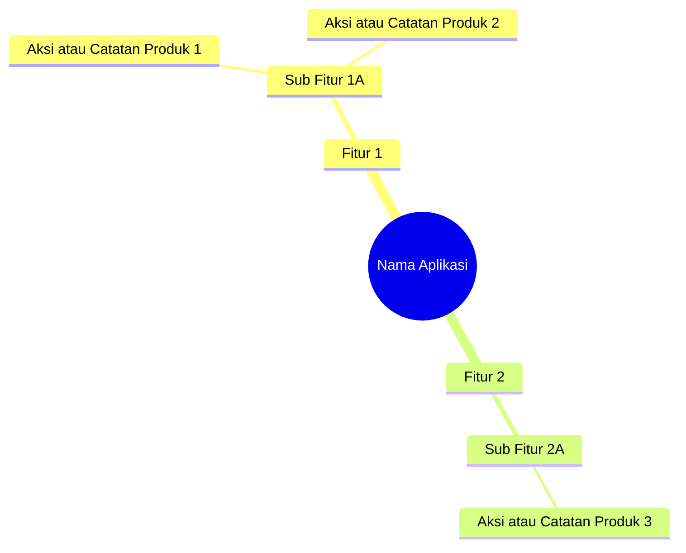
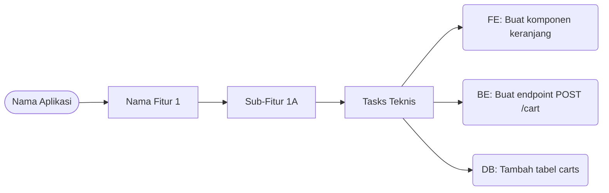

# PRD Visualisasi 🎨

Skill untuk mengubah spesifikasi produk menjadi bentuk visual flowchart atau mindmap hierarkis. Visualisasi ini membantu memetakan struktur fitur aplikasi dengan sangat jelas seperti cabang pohon (Root -> Fitur -> Sub-Fitur -> Leaf).

Skill ini beroperasi dalam **Dua Fase** yang berbeda tergantung pada sejauh mana dokumen proyek telah rampung.

---

## 1. Fase Produk (Mode Awal / Belum Lengkap)

**Kapan dipicu:** SECARA OTOMATIS setelah skill `fitur-plan` selesai merangkum dokumen. Pada tahap ini, detail teknis (Database, Backend, Frontend) belum ada.

**Sumber Data:** Membaca dokumen `docs/product/fitur-plan.md`.

**Output Dokumen:** Disimpan ke `docs/product/prd-visual.md`.

**Hierarki Visual:**
`[Nama Aplikasi] -> [Nama Fitur] -> [Sub-fitur] -> [Aksi User / Deskripsi]`

**Template Fase Produk (Mindmap):**

---

## 2. Fase Engineering (Mode Lengkap / Siap Coding)

**Kapan dipicu:** Dipanggil secara manual atau otomatis setelah tim teknis (Frontend, Backend, Database) menyelesaikan dokumen spesifikasi dan memecah *Task* teknikal mereka.

**Sumber Data:** Membaca `fitur-plan.md` dipadukan dengan dokumen task spesifik (seperti task frontend, backend, dan database).

**Output Dokumen:** Disimpan ke `docs/product/visual-featur.md`.

**Hierarki Visual:**
`[Nama Aplikasi] -> [Nama Fitur] -> [Sub-fitur] -> [Task Frontend / Task Backend / Task Database]`

**Template Fase Engineering (Flowchart LR):**

---

## Langkah Kerja AI

Jika Anda dipanggil, lakukan pengecekan berikut:

1. **Tentukan Fase:** Periksa di dalam sistem apakah dokumen teknis (seperti daftar Task Frontend/Backend) sudah ada.
   - Jika BELUM ADA, jalankan **Fase Produk**.
   - Jika SUDAH LENGKAP, jalankan **Fase Engineering**.

2. **Generasi Diagram:** Buat diagram (gunakan `mindmap` atau `flowchart LR`) yang secara komprehensif merangkum fitur sesuai fase yang sedang berjalan. 

3. **Simpan ke File yang Tepat:**
   - Fase Produk -> Simpan ke file `docs/product/prd-visual.md`
   - Fase Engineering -> Simpan ke file `docs/product/visual-featur.md`

4. **Tampilkan Preview (Wajib):** Anda WAJIB me-*render* (mencetak) kode Mermaid tersebut secara langsung di dalam chat (menggunakan format \`\`\`mermaid) agar pengguna bisa melihat hasil gambarnya secara visual langsung di layar (seperti bentuk *mindmap* mendatar) tanpa perlu membuka aplikasieksternal.

---

## Anti-Pola
- ❌ Dilarang membuat flowchart proses beralur (*Decision Tree* Yes/No). Diagram ini HANYA untuk *Feature Breakdown* (Struktur hierarki mendatar seperti pohon).
- ❌ Dilarang memasukkan Task teknikal (seperti "Buat tabel" atau "Buat komponen") jika Anda sedang berada di **Fase Produk** (belum lengkap).
- ❌ **ATURAN ANTI-HALUSINASI:** DILARANG KERAS mengarang, membuat, atau menebak sendiri task/implementasi teknis. Anda HANYA BOLEH menggunakan data dan task yang secara eksplisit tertulis di dokumen sumber (`fitur-plan.md` atau dokumen task teknis). Jika informasi belum ada, JANGAN mengarangnya!

---

## Langkah Selanjutnya
Setelah diagram visualisasi selesai disimpan dan ditampilkan secara visual di layar, tanyakan kepada pengguna:
- Jika di **Fase Produk**: *"Apakah struktur fitur visual ini sudah pas? Jika sudah disetujui, mari kita panggil skill **`prd-spesifikasi`** untuk mengunci detail Acceptance Criteria-nya."*
- Jika di **Fase Engineering**: *"Apakah peta task ini sudah siap untuk mulai kita eksekusi (coding) sekarang juga?"*
